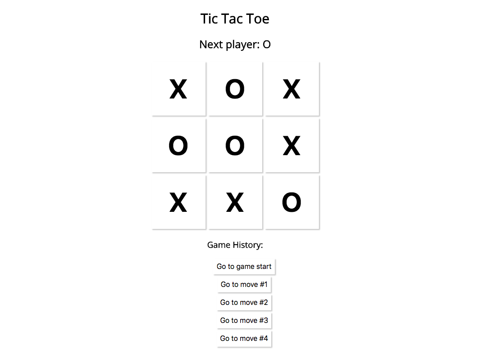

# Tic Tac Toe

This project was bootstrapped with [Create React App](https://github.com/facebookincubator/create-react-app).

Next suggested steps according to Reactjs documentation: 

- Improve design.
- Display the location for each move in the format (col, row) in the move history list.
- Bold the currently selected item in the move list.
- Rewrite Board to use two loops to make the squares instead of hardcoding them.
- Add a toggle button that lets you sort the moves in either ascending or descending order.
- When someone wins, highlight the three squares that caused the win.
- When someone wins, add backdrop and add 'play again?' button.
- When no one wins, display a message about the result being a draw.

Current look:

